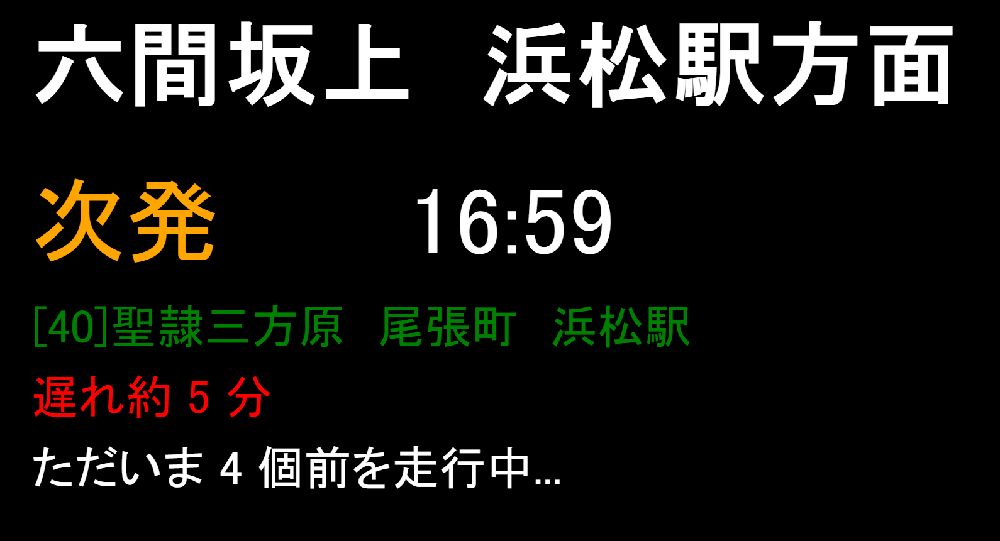

# 遠鉄デジタルサイネージ

接近中の遠鉄バスの, 系統・発車時刻・遅延時刻をリアルタイムで表示するデジタルサイネージです. 以下のような画面を表示してくれます. 




## 技術的な面
ほげ

## API部分
### 得る情報
- 六間坂上から最も近い, 浜松駅を終点とするバスが
    - 何個前のバス停を走行中であるか
    - 何分に到着するか
    - 現在何分遅延しているか

### 方法
 [六間坂上から浜松駅へのバスどこ!?](https://transfer-cloud.navitime.biz/entetsu/approachings?departure-busstop=00460589&arrival-busstop=00460001)を使用, このサイトから情報をスクレイピング・計算することによりサイネージを構成しています. 

### 想定されるJSON
```json
{
    "bus": "[40]聖隷三方原　尾張町　浜松駅", 
    "time": "22:21", 
    "delay": 3, 
    "pres": 23 
}
```

## APP部分
~~まともに書いてないから語ってはいけない~~


## 備忘録
曜日が祝日対応していない=>本当にやりたくない \
マジックナンバーだらけ=>本当にやりたくない 